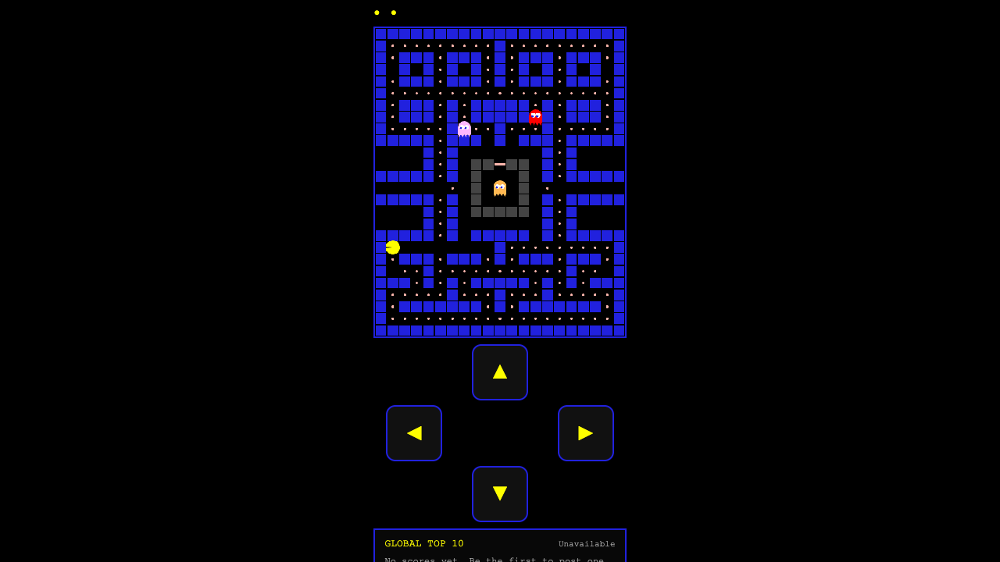

# Pac-Man

Zero-dependency HTML5 Canvas Pac-Man with mobile controls, deterministic debug hooks, Vercel deployment, and a Supabase-backed global leaderboard.

[Live demo](https://pacman-pearl.vercel.app)



## What This Demonstrates

- A complete browser game loop in plain HTML, CSS, and JavaScript
- Responsive desktop and mobile controls without a frontend framework
- Serverless leaderboard API deployed on Vercel
- Supabase persistence with the service role key kept server-side
- Deterministic browser debug hooks for faster validation
- Small, inspectable code rather than architecture for its own sake

## Features

- Arcade-style maze gameplay with distinct ghost behavior
- Touch swipe and on-screen D-pad controls for phone play
- Local high score stored in browser `localStorage`
- Shared online leaderboard with name submission on game over
- Multi-level progression with fruit bonuses
- Pause with `P`, fullscreen with `F`
- Debug hooks: `window.render_game_to_text()` and `window.advanceTime(ms)`

## Run Locally

This is a static site. Any simple file server works.

```bash
python3 -m http.server 8000
```

Then open `http://localhost:8000`.

Use Vercel Dev when you want the leaderboard API available locally:

```bash
cp .env.example .env.local
vercel dev
```

## Controls

- Desktop: arrow keys or `WASD`
- Pause/resume: `P`
- Fullscreen: `F`
- Exit fullscreen: `Esc`
- Mobile: swipe on the game board or use the on-screen D-pad

## Debug Hooks

The game exposes two browser-console hooks for automated validation and fast manual debugging:

```js
window.render_game_to_text();
window.advanceTime(1000);
```

`render_game_to_text()` returns the current game state as JSON. `advanceTime(ms)` steps the game deterministically at a 60 FPS equivalent and returns the updated JSON state.

## Supabase Setup

1. Create a Supabase project.
2. In the Supabase SQL editor, run `supabase/schema.sql`.
3. In Vercel project settings, add `SUPABASE_URL` and `SUPABASE_SERVICE_ROLE_KEY`.
4. For local development, put the same values in `.env.local`.

The browser never receives the service role key. Leaderboard reads and writes go through the server-side Vercel function in `api/leaderboard.js`.

## Deploy

Linked to Vercel. Deploy from the repo root:

```bash
vercel --prod
```

## Files

- `index.html` - full game runtime
- `api/leaderboard.js` - server-side leaderboard API
- `supabase/schema.sql` - leaderboard table schema
- `assets/pacman-screenshot.png` - README screenshot

## License

MIT. See [LICENSE](LICENSE).
